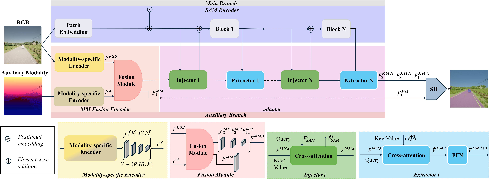
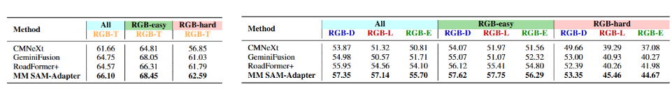
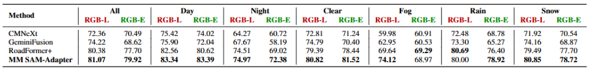

<h1 align="center"> Multimodal SAM-Adapter for Semantic Segmentation </h1> 


<br>
:rotating_light: This repository contains download links to dataset, code snippets, and trained deep models of our work  "Multimodal SAM-Adapter for Semantic Segmentation", 
 
by [Iacopo Curti*](https://www.unibo.it/sitoweb/iacopo.curti2), [Pierluigi Zama Ramirez*](https://pierlui92.github.io/), Alioscia Petrelli*
, and [Luigi Di Stefano*](https://www.unibo.it/sitoweb/luigi.distefano).  \* _Equal Contribution_

University of Bologna


<div class="alert alert-info">


<h2 align="center"> 

</h2>


## :bookmark_tabs: Table of Contents

1. [Introduction](#clapper-introduction)
2. [Dataset](#file_cabinet-dataset)
3. [Pretrained Models](#inbox_tray-pretrained-models)
4. [Code](#memo-code)
5. [Checkpoints](#floppy_disk-checkpoints)
5. [Quantitative Results](#bar_chart-quantitative-results)
6. [Qualitative Results](#art-qualitative-results)
7. [Contacts](#envelope-contacts)


## :clapper: Introduction
</div>

Semantic segmentation, an essential task for applications such as autonomous driving, medical imaging,
and robotics, has advanced enormously with deep learning but still struggles in challenging conditions
such as poor lighting and adverse weather. Multimodal approaches incorporating auxiliary sensor data (e.g.,
LiDAR, infrared) have emerged to address these limitations. This work introduces MM SAM-adapter, a novel
framework that leverages the Segment Anything Model (SAM) for multimodal semantic segmentation. Our
approach consists of an adapter network that injects multimodal fused features into SAM’s rich RGB features.
This strategy allows the model to prioritize RGB information while selectively incorporating auxiliary
data when beneficial. We conduct extensive experiments on multimodal benchmarks such as DeLiVER,
FMB, and MUSES, where MM SAM-adapter achieves state-of-the-art performance. Additionally, we
manually divide DeLIVER and FMB into RGB-easy and RGB-hard splits, to evaluate better the impact of
employing synergistically auxiliary modalities. Our results demonstrate that MM SAM-adapter outperforms
competitors in easy and challenging scenarios.
<h4 align="center">

</h4>




## :file_cabinet: Dataset

In our experiments, we employed three datasets featuring different modalities: DeLiVER, MUSES and FMB. Those datasets have been downloaded from the corresponding repositories. See `datasets` folder for further details.


## :inbox_tray: Pretrained Models

In order to download the SAM backbone that we have used during the paper it is needed to run the script:
```
python /segmentation/tools/SAM_checkpoint_convert.py
```


To use these weights, please follow these steps:

1. Create a folder named `pretrained` in the segmentation directory.
3. Copy the downloaded weights into the `pretrained` folder.

## :memo: Code


### :hammer_and_wrench: Setup Instructions


Install [MMSegmentation v0.20.2](https://github.com/open-mmlab/mmsegmentation/tree/v0.20.2) following the instructions:

```
cd segmentation
# recommended environment: torch1.9 + cuda11.1
conda create -n MMSAMAD python==3.9
conda activate MMSAMAD
pip install torch==1.9.0+cu111 torchvision==0.10.0+cu111 torchaudio==0.9.0 -f https://download.pytorch.org/whl/torch_stable.html
pip install mmcv-full==1.4.2 -f https://download.openmmlab.com/mmcv/dist/cu111/torch1.9.0/index.html
pip install timm==0.4.12
pip install numpy==1.24.3
pip install yapf==0.40.1
pip install mmsegmentation==0.20.2
pip install tqdm
pip install "opencv-python<4.9.0"
pip install "opencv-python<4.9.0"
pip install setuptools==59.5.0
pip install tensorboard
pip install scipy
pip install einops==0.8.0
cd ops
bash make.sh # compile deformable attention
```
You should also create a folder called data within the segmentation folder where a symbolic path to each dataset is created:
```
ln -s /path/to/DELIVER /data
ln -s /path/to/muses /data
ln -s /path/to/FMB /data
```


### :rocket: Train our network
To train MM SAM-Adapter + Segformer head on DeLiVER on a single node with 2 gpus run:
```
cd segmentation
bash dist_train.sh configs/DELIVER/Segformer_MMSAM_adapter_large_DELIVER_1024x1024_ss_RGBLIDAR.py 2
```

### :rocket: Evaluation of our network

To evaluate MM SAM-Adapter + Segformer head on DeLiVER test set on a single node with 1 gpu run:
```
cd segmentation
bash dist_test.sh configs/DELIVER/Segformer_MMSAM_adapter_large_DELIVER_1024x1024_ss_RGBLIDAR.py /path/to/checkpoint_file 1 --eval mIoU --show-dir visualization_directory --resize-dim 1024 1024 #resize-dim is (800,600) in case of FMB
```
To evaluate MM SAM-Adapter + Segformer head on DeLiVER test set in easy/hard split on a single node with 1 gpu run the command mentioned below. In order to do this kind of evaluation it is needed to change the test dict within the config file specifying the type of dataset needed, i.e. DELIVER_easy:
```
cd segmentation
bash dist_test.sh configs/DELIVER/Segformer_MMSAM_adapter_large_DELIVER_1024x1024_ss_RGBLIDAR_easy.py /path/to/checkpoint_file 1 --eval mIoU --show-dir visualization_directory --resize-dim 1024 1024 #resize-dim is (800,600) in case of FMB
```

### :rocket: Infer of MUSES test set

```
cd segmentation
bash dist_infer.sh configs/MUSES/Segformer_MMSAM_adapter_large_MUSES_1024x1024_ss_RGBLIDAR.py /path/to/checkpoint_file 1 --eval mIoU --show-dir inference_directory --resize-dim 1080 1920 #resize-dim is (800,600) in case of FMB
```

## :floppy_disk: Checkpoints

Download pretrained checkpoints for MM SAM-Adapter from the links below and place them in a specific folder (i.e. `work_dirs`).

**DELIVER**
| Method           | Backbone    | Crop Size | Input Modalities      | mIoU      | Download                                                                                                              |
|------------------|-------------|-----------|-----------------------|-----------|-----------------------------------------------------------------------------------------------------------------------|
| MM SAM-Adapter   | ConvNext-S  | 1024      | RGB + LiDAR          |     57.14      | [ckpt](https://drive.google.com/file/d/1sez-j2Tgb9lPxZbtyIfNRrb_MF6Kla8e/view?usp=sharing) |
| MM SAM-Adapter   | ConvNext-S  | 1024      | RGB + Depth          |      57.35     | [ckpt](https://drive.google.com/file/d/1lY1vYrGPeESEvb7FX6wSCPPcLJJ3k1Eo/view?usp=sharing) |
| MM SAM-Adapter   | ConvNext-S  | 1024      | RGB + Event          |      55.70     | [ckpt](https://drive.google.com/file/d/1KnL5lzdIKM99nIT42dB8jbXcpUfdJkvp/view?usp=sharing) |

**FMB**
| Method           | Backbone    | Crop Size | Input Modalities      | mIoU      | Download                                                                                                              |
|------------------|-------------|-----------|-----------------------|-----------|-----------------------------------------------------------------------------------------------------------------------|
| MM SAM-Adapter   | ConvNext-S  | 800      | RGB + Thermal          |     66.10      | [ckpt](https://drive.google.com/file/d/1w_A5rdLgpIMhtQ_QSKJb2cEN2akePgY0/view?usp=sharing) |


**MUSES**
| Method           | Backbone    | Crop Size | Input Modalities      | mIoU      | Download                                                                                                              |
|------------------|-------------|-----------|-----------------------|-----------|-----------------------------------------------------------------------------------------------------------------------|
| MM SAM-Adapter   | ConvNext-S  | 1024      | RGB + LiDAR          |     81.07      | [ckpt](https://drive.google.com/file/d/1QZ31283E10aXymF6VaptmuL7oEvL2irR/view?usp=sharing) |
| MM SAM-Adapter   | ConvNext-S  | 1024      | RGB + Event          |     79.92      | [ckpt](https://drive.google.com/file/d/1S7BatJmGHWKZo6TGcCn-OS7wHGRiY82B/view?usp=sharing) |

<!-- To finetune networks refer to the example in `scripts/finetune.sh` -->

<!-- ### :rocket: Monocular Virtual Depth Generation

To generate virtual depth from depth networks using our in-paiting strategy refer to the example in `scripts/generate_virtual_depth.sh`

### :rocket: Stereo Proxy Depth Generation

To generate proxy depth maps with our merging strategy to finetune stereo networks you can use `create_proxy_stereo.py`. 

As explained above, we will not release the code for finetuning stereo networks. However, our implementation was based on the official codes of [RAFT-Stereo](https://github.com/princeton-vl/RAFT-Stereo) and [CREStereo](https://github.com/megvii-research/CREStereo). -->
## :bar_chart: Quantitative Results

In this section, we present the main quantitative results presented in our paper.
The following two tables shows  DeLiVER test set results in the RGB-Depth (RGB-D), RGB-LiDAR (RGB-L), and RGB-Event (RGB-E) setups (RIGHT) and  FMB test set results in the RGB-Thermal (RGB-T) setup across
different scenarios (LEFT).
<p float="left">

</p>
The following table shows MUSES test results in the RGB-LiDAR (RGB-L) and RGB-Event (RGB-E) setups for different weather conditions.
<p float="left">

</p>


## :art: Qualitative Results

In this section, we present illustrative examples that demonstrate the effectiveness of our proposal.

<p float="left">

</p>
<p float="left">

</p>

## :envelope: Contacts

For questions, please send an email to iacopo.curti2@unibo.it, pierluigi.zama@unibo.it


## License

This repository is released under the Apache 2.0 license as found in the [LICENSE](LICENSE.md) file.


## :pray: Acknowledgements

We would like to extend our sincere appreciation to the authors of the following projects for making their code available, which we have utilized in our work:

- We would like to thank the authors of [DeLiVER](https://github.com/jamycheung/DELIVER), [ViT-Adapter](https://github.com/czczup/ViT-Adapter), [MUSES](https://github.com/timbroed/MUSES) for providing their code, which has been instrumental in our experiments.

We deeply appreciate the authors of the competing research papers for their helpful responses, and provision of model weights, which greatly aided accurate comparisons.